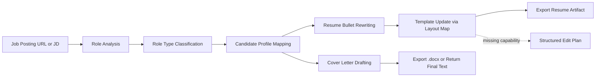

# OfferHelper

<p align="center">
  <strong>Tailor resumes and cover letters from a job posting, with a maintained candidate profile and template-aware editing workflow.</strong>
</p>

<p align="center">
  <a href="https://github.com/zaneding/offerhelper"></a>
  <a href="./LICENSE"></a>
  <a href="./.claude-plugin/plugin.json"></a>
  <a href="#中文"></a>
</p>

<p align="center">
  <a href="#中文">中文</a> · <a href="#english">English</a>
</p>

OfferHelper is a Claude Code skill and plugin workflow for application tailoring. It analyzes a job posting, identifies the strongest matching evidence from a maintained candidate profile, rewrites resume content with clearer impact framing, and can update a mapped template when editing capability is available.

> GitHub README does not support real tab components by default. This file uses GitHub-native `<details>` sections as the most stable bilingual switch pattern.

## At a Glance

- Input: job posting URL or pasted JD
- Output: tailored resume, German `Anschreiben`, or a full application package
- Works with: a verified candidate profile, a resume layout map, and optional private runtime config
- Fallback behavior: returns a structured edit plan when direct editing or export is unavailable



<details open>
<summary><strong>中文</strong></summary>

<a id="中文"></a>

## 目录

- [项目定位](#cn-positioning)
- [功能总览](#cn-features)
- [快速开始](#cn-quickstart)
- [所需配置](#cn-setup)
- [工作流](#cn-workflow)
- [示例 Prompt](#cn-prompts)
- [仓库结构](#cn-structure)
- [设计原则](#cn-principles)
- [FAQ](#cn-faq)
- [Roadmap](#cn-roadmap)
- [贡献与许可证](#cn-contributing)

<a id="cn-positioning"></a>

## 项目定位

`OfferHelper` 是一个面向 **Claude Code / Claude 插件工作流** 的求职材料定制 skill。它接收职位链接或职位描述，结合你维护的候选人资料、模板字段映射和私有配置，产出：

- 定制版简历内容
- 德文 `Anschreiben` / cover letter
- 在具备编辑与导出能力时直接更新模板并输出成品

这个仓库同时包含两层内容：

- 发布用插件内容：`skills/offerhelper/`
- 当前维护者本地使用的 skill 与参考文件：仓库根目录 `SKILL.md` 与 `references/`

它适合这类使用方式：

- 高频投递相近岗位，需要快速做定制化版本
- 已有固定简历模板，不想每次手工挪版式
- 强调真实表达，不依赖虚构经历和硬塞关键词
- 面向德国求职场景，尤其是简历加 `Anschreiben`

<a id="cn-features"></a>

## 功能总览

| 能力 | 说明 |
|---|---|
| 岗位解析 | 提取职位名称、公司、must-have、关键词、软技能要求 |
| 岗位分类 | 识别 `DA-heavy`、`BA-heavy`、`Strategy / Ops` |
| 证据映射 | 从候选人资料中抽取已验证经历，匹配 JD 核心要求 |
| 简历重写 | 用“业务背景 + 方法/工具 + 结果/影响”重写 bullets |
| 模板更新 | 基于 layout map 精准修改 subtitle、经历区、技能区等 |
| 求职信生成 | 输出德文 DIN 5008 风格一页版 `Anschreiben` |
| 降级回退 | 缺失模板编辑能力时，返回结构化编辑方案 |

## 为什么这个项目不是“普通关键词优化器”

- 它依赖 **已验证候选人资料**，不是凭空编造经历
- 它强调 **证据质量**，不是简单把 JD 词汇机械替换进简历
- 它支持 **模板映射**，能把“内容优化”连接到“可交付简历成品”
- 它把 **resume + cover letter** 放在同一条工作流里，不是两个孤立步骤

<a id="cn-quickstart"></a>

## 快速开始

> 前提：GitHub 仓库名应为 `offerhelper`，插件元数据也按这个名称发布。

### 1. 添加 marketplace

```bash
/plugin marketplace add offerhelper github:zaneding/offerhelper
```

### 2. 安装插件

```bash
/plugin install offerhelper@offerhelper
```

### 3. 准备最小配置

在你的项目目录下新建 `references/`，至少准备：

- `references/candidate-profile.md`
- `references/resume-layout-map.md` 或等价布局映射文件
- `references/private-config.md`

模板与示例可参考：

- `skills/offerhelper/references/candidate-profile-template.md`
- `skills/offerhelper/references/resume-layout-map-template.md`
- `skills/offerhelper/references/private-config.example.md`

当前维护者本地还使用：

- `references/candidate-profile.md`
- `references/canva-layout-map.md`
- `references/private-config.example.md`

<a id="cn-setup"></a>

## 所需配置

| 文件 | 用途 | 是否应提交到仓库 |
|---|---|---|
| `references/candidate-profile.md` | 候选人的真实经历、能力簇、定制指导 | 可以，前提是内容已脱敏 |
| `references/resume-layout-map.md` | 模板中允许修改的逻辑区域、字段 ID、限制规则 | 可以 |
| `references/private-config.md` | 联系方式、模板 ID、编辑 URL、导出偏好 | 不可以 |

推荐把配置理解成三层：

1. `candidate-profile` 负责“你真正做过什么”
2. `layout-map` 负责“哪些位置允许怎么改”
3. `private-config` 负责“真实身份数据和运行时私有参数”

<a id="cn-workflow"></a>

## 工作流

### 1. 分析岗位

Skill 会提取：

- 职位名称
- 公司
- must-have 要求
- 技术关键词
- 软技能与协作要求
- 招聘方最关心的 3 个筛选点

### 2. 确定定制策略

Skill 会根据岗位类型，从候选人资料中选择更合适的证据簇：

- `DA-heavy`：偏 SQL、分析、dashboard、数据流程
- `BA-heavy`：偏需求、流程、stakeholder、KPI、跨团队协作
- `Strategy / Ops`：偏流程优化、业务运营、项目推进、结果导向

### 3. 重写简历内容

重点更新通常包括：

- 副标题 / target role line
- 当前岗位 achievement bullets
- 历史经历区块
- 技能列表

推荐 bullet 结构：

> `业务背景/问题` + `工具或方法` + `结果/影响`

### 4. 更新模板或返回编辑方案

- 如果具备模板编辑能力和私有配置：直接更新模板并导出
- 如果条件不完整：返回结构化编辑建议，不伪装成已完成编辑

### 5. 生成求职信

- 默认面向德国求职场景
- 偏 DIN 5008 风格
- 尽量压缩在一页 A4 内

<a id="cn-prompts"></a>

## 示例 Prompt

完整工作流：

```text
这是我想申请的岗位：[职位链接或JD]
请根据这个岗位帮我定制简历，并写一版德语 Anschreiben。
```

只改简历：

```text
这是岗位描述。只改简历，不需要求职信。
```

只生成求职信：

```text
这是岗位描述。请只生成德语 Anschreiben，简历不用改。
```

<a id="cn-structure"></a>

## 仓库结构

```text
offerhelper/
├── .claude-plugin/
│   └── plugin.json
├── skills/
│   └── offerhelper/
│       ├── SKILL.md
│       └── references/
│           ├── candidate-profile-template.md
│           ├── resume-layout-map-template.md
│           └── private-config.example.md
├── references/
│   ├── candidate-profile.md
│   ├── canva-layout-map.md
│   └── private-config.example.md
├── SKILL.md
├── package.json
└── README.md
```

关键目录含义：

| 路径 | 说明 |
|---|---|
| `.claude-plugin/plugin.json` | 插件元数据 |
| `skills/offerhelper/SKILL.md` | 更适合发布的插件 skill 定义 |
| `SKILL.md` | 当前维护者本地使用的工作流版本 |
| `references/` | 维护者本地参考文件 |
| `package.json` | 项目信息和文档校验脚本入口 |

<a id="cn-principles"></a>

## 设计原则

- 真实优先：不虚构项目、指标、工具或职责
- 证据优先：每个 bullet 应说明这段经历证明了什么
- 可交付优先：不仅生成内容，还考虑模板落地与导出
- 隐私优先：真实联系方式、模板链接、字段 ID 放在私有配置中

<a id="cn-faq"></a>

## FAQ

### 可以不用 Canva 吗？

可以。`canva-layout-map` 只是当前维护者的一个具体实现。这个 skill 的核心依赖是“布局映射”概念，不强绑定某一个模板工具。

### 如果没有私有配置会怎样？

Skill 仍可分析岗位并生成定制内容，但不会声称自己已经完成模板编辑或导出。它应回退为结构化编辑方案。

### 这个仓库能直接拿去给别人用吗？

可以作为模板 fork，但你需要替换自己的候选人资料、布局映射和私有配置。

### GitHub 上能不能做真正的中英切换 tab？

不能稳定做到。GitHub README 原生不支持自定义前端组件，所以这里用 `<details>` 做最稳妥的切换式阅读。

<a id="cn-roadmap"></a>

## Roadmap

- 支持更多模板工具的布局映射示例
- 补充更通用的 `resume-layout-map` 公开模板
- 增加导出与 artifact 返回的自动化能力
- 补充更多岗位类型的 tailoring guidance

<a id="cn-contributing"></a>

## 贡献与许可证

欢迎 fork 后按自己的求职工作流调整，也欢迎针对以下方向提交改进：

- 更通用的模板映射方案
- 更清晰的 skill 提示词结构
- 更稳健的输出与降级策略
- 文档、示例和公开模板完善

许可证：`MIT`。详见 `LICENSE`。

</details>

<details>
<summary><strong>English</strong></summary>

<a id="english"></a>

## Contents

- [Positioning](#en-positioning)
- [Feature Overview](#en-features)
- [Quick Start](#en-quickstart)
- [Required Setup](#en-setup)
- [Workflow](#en-workflow)
- [Example Prompts](#en-prompts)
- [Repository Structure](#en-structure)
- [Design Principles](#en-principles)
- [FAQ](#en-faq)
- [Roadmap](#en-roadmap)
- [Contributing and License](#en-contributing)

<a id="en-positioning"></a>

## Positioning

`OfferHelper` is a **Claude Code skill / plugin workflow** for application tailoring. It takes a job posting URL or pasted JD, then combines a maintained candidate profile, a layout map, and private runtime configuration to produce:

- tailored resume content
- a German `Anschreiben` / cover letter
- direct template updates and export when the required capability is available

This repository contains two layers:

- publishable plugin content in `skills/offerhelper/`
- the maintainer's local skill and reference files in the repo root

It is best suited for:

- repeated applications to similar roles
- fixed resume templates that should be updated rather than rebuilt manually
- truthful tailoring based on verified evidence
- German job application workflows, especially resume plus `Anschreiben`

<a id="en-features"></a>

## Feature Overview

| Capability | Description |
|---|---|
| Job analysis | Extracts title, company, must-haves, keywords, and soft-skill expectations |
| Role classification | Detects `DA-heavy`, `BA-heavy`, or `Strategy / Ops` patterns |
| Evidence mapping | Maps JD requirements to verified candidate evidence |
| Resume rewriting | Rewrites bullets with clearer business context, method, and impact |
| Template update | Updates mapped logical fields such as subtitle, experience, and skills |
| Cover letter generation | Produces a German DIN 5008-style one-page `Anschreiben` |
| Graceful fallback | Returns a structured edit plan when editing or export is unavailable |

## Why this is not just a keyword optimizer

- It relies on a **verified candidate profile** instead of invented claims
- It emphasizes **evidence quality** instead of shallow keyword stuffing
- It supports a **layout-map-driven workflow** that can reach a usable artifact
- It keeps **resume + cover letter** in one workflow rather than two disconnected steps

<a id="en-quickstart"></a>

## Quick Start

> Prerequisite: the GitHub repository name should be `offerhelper`, matching the plugin metadata.

### 1. Add the marketplace

```bash
/plugin marketplace add offerhelper github:zaneding/offerhelper
```

### 2. Install the plugin

```bash
/plugin install offerhelper@offerhelper
```

### 3. Prepare the minimum setup

Create a `references/` folder in your project with at least:

- `references/candidate-profile.md`
- `references/resume-layout-map.md` or an equivalent layout map
- `references/private-config.md`

Reference templates included in this repo:

- `skills/offerhelper/references/candidate-profile-template.md`
- `skills/offerhelper/references/resume-layout-map-template.md`
- `skills/offerhelper/references/private-config.example.md`

The maintainer's local workflow also uses:

- `references/candidate-profile.md`
- `references/canva-layout-map.md`
- `references/private-config.example.md`

<a id="en-setup"></a>

## Required Setup

| File | Purpose | Should be committed |
|---|---|---|
| `references/candidate-profile.md` | Verified experience, competency clusters, tailoring guidance | Yes, if sanitized |
| `references/resume-layout-map.md` | Editable zones, field IDs, and guardrails | Yes |
| `references/private-config.md` | Contact details, template IDs, edit URLs, output preferences | No |

Think of the configuration as three layers:

1. `candidate-profile` defines what the candidate has actually done
2. `layout-map` defines what parts of the template may change and how
3. `private-config` defines identity data and runtime-only configuration

<a id="en-workflow"></a>

## Workflow

### 1. Analyze the job

The skill extracts:

- title
- company
- must-have requirements
- technical keywords
- soft-skill and stakeholder expectations
- the top 3 screening criteria

### 2. Build a tailoring strategy

The role type determines which evidence cluster should lead:

- `DA-heavy`: SQL, analytics, dashboards, data workflows
- `BA-heavy`: requirements, stakeholder alignment, KPI framing, process work
- `Strategy / Ops`: workflow optimization, operational ownership, business outcomes

### 3. Rewrite resume content

Typical update targets:

- subtitle / target role line
- current-role achievement bullets
- prior-experience block
- skills list

Preferred bullet structure:

> `business context / problem` + `tool or method` + `result / impact`

### 4. Update the template or return an edit plan

- If private config and editing capability are available: update the template and export
- If not: return a structured edit plan instead of pretending the edit was completed

### 5. Generate the cover letter

- optimized for German application workflows
- usually DIN 5008 style
- compressed to one A4 page when possible

<a id="en-prompts"></a>

## Example Prompts

Full workflow:

```text
Here's a job I want to apply for: [job URL or pasted JD]
Please tailor my resume and write a German Anschreiben for it.
```

Resume only:

```text
Here is the job description. Resume only, no cover letter.
```

Cover letter only:

```text
Here is the job description. Please generate only the German Anschreiben and do not update the resume.
```

<a id="en-structure"></a>

## Repository Structure

```text
offerhelper/
├── .claude-plugin/
│   └── plugin.json
├── skills/
│   └── offerhelper/
│       ├── SKILL.md
│       └── references/
│           ├── candidate-profile-template.md
│           ├── resume-layout-map-template.md
│           └── private-config.example.md
├── references/
│   ├── candidate-profile.md
│   ├── canva-layout-map.md
│   └── private-config.example.md
├── SKILL.md
├── package.json
└── README.md
```

Key paths:

| Path | Purpose |
|---|---|
| `.claude-plugin/plugin.json` | Plugin metadata |
| `skills/offerhelper/SKILL.md` | Plugin-oriented skill definition |
| `SKILL.md` | Maintainer-local workflow definition |
| `references/` | Maintainer-local reference files |
| `package.json` | Project metadata and README validation entry point |

<a id="en-principles"></a>

## Design Principles

- Truthfulness first: do not invent projects, metrics, tools, or responsibilities
- Evidence first: every bullet should prove something meaningful
- Deliverability first: optimize not only wording, but also template fit and exportability
- Privacy first: keep identity data, edit URLs, and sensitive IDs in private config

<a id="en-faq"></a>

## FAQ

### Does this require Canva?

No. `canva-layout-map` is just the maintainer's current implementation. The underlying concept is a layout map, not a hard Canva dependency.

### What happens if private config is missing?

The skill can still analyze the role and generate tailored content, but it should not claim that template editing or export was completed. It should fall back to a structured edit plan.

### Can I fork this repo for my own workflow?

Yes. Treat it as a template and replace the candidate profile, layout map, and private configuration with your own.

### Why use `<details>` instead of real language tabs?

Because GitHub README rendering does not reliably support custom interactive tab components. `<details>` is the most stable native fallback.

<a id="en-roadmap"></a>

## Roadmap

- Add more example layout maps for different template tools
- Publish a more generic public `resume-layout-map` template
- Expand automated export and artifact-return support
- Improve tailoring guidance for more role categories

<a id="en-contributing"></a>

## Contributing and License

Forks and workflow-specific adaptations are expected. Contributions are most useful in these areas:

- more reusable layout-map conventions
- clearer skill prompts and output contracts
- more robust fallback behavior
- better docs, examples, and public templates

License: `MIT`. See `LICENSE`.

</details>
