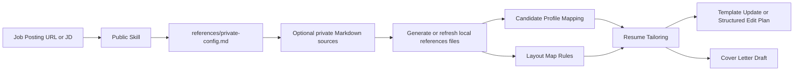

# OfferHelper

<p align="center">
  <strong>Tailor resumes and cover letters from a job posting, with a public-safe plugin and a private-data workflow that stays outside the public repo.</strong>
</p>

<p align="center">
  <a href="https://github.com/zaneding/offerhelper"></a>
  <a href="./LICENSE"></a>
  <a href="./.claude-plugin/plugin.json"></a>
  <a href="#中文"></a>
</p>

<p align="center">
  <a href="#中文">中文</a> · <a href="#english">English</a>
</p>

OfferHelper is a Claude Code skill and plugin workflow for application tailoring. The public repo ships only reusable skill logic, templates, and onboarding. Personal candidate data, live Canva metadata, and private notes stay in a separate private repo or ignored local files, accessed through a single runtime interface: `references/private-config.md`. In this setup, the private source-of-truth repo can be `offerhelpe_privat`.

> GitHub README does not support real tab components by default. This file uses GitHub-native `<details>` sections as the most stable bilingual switch pattern.

## At a Glance

- Input: job posting URL or pasted JD
- Output: tailored resume, cover letter, or a structured edit plan
- Public repo ships no personal data
- Private data enters only through local `references/private-config.md`
- Users can fill `references/` manually or let Claude generate/enrich it from private Markdown sources



<details open>
<summary><strong>中文</strong></summary>

<a id="中文"></a>

## 目录

- [项目定位](#cn-positioning)
- [Public / Private 分层](#cn-split)
- [快速开始](#cn-quickstart)
- [初始化配置](#cn-setup)
- [私有接口：private-config](#cn-private-config)
- [工作流](#cn-workflow)
- [仓库结构](#cn-structure)
- [隐私与安全](#cn-safety)
- [FAQ](#cn-faq)

<a id="cn-positioning"></a>

## 项目定位

`OfferHelper` 是一个面向 Claude Code 的求职材料定制 skill。它读取职位链接或职位描述，结合候选人资料、简历模板映射和运行时配置，生成：

- 定制版简历内容
- 定制版求职信
- 在可编辑能力存在时的模板更新结果
- 在能力不足时的结构化编辑方案

公开版的目标很明确：

- 仓库本身不携带任何个人信息
- 插件本体只包含通用逻辑、模板和教程
- 真实候选人资料、Canva 元数据、联系方式只留在私有 repo 或本地忽略文件里

<a id="cn-split"></a>

## Public / Private 分层

### 公开 `main` 包含什么

- 插件元数据
- 可安装的公开 skill：`skills/offerhelper/SKILL.md`
- 三个公开模板：
  - `candidate-profile-template.md`
  - `resume-layout-map-template.md`
  - `private-config.example.md`
- README 和校验脚本

### 私有 repo 或本地忽略文件包含什么

- 真实候选人经历
- 真实联系方式
- Canva 设计 ID、编辑链接、page ID、field ID
- 私有工作流笔记
- 可被 Claude 读取的 private Markdown source files

### 推荐使用方式

1. 保持这个仓库为公开、可分发版本
2. 另建一个 private repo 保存你的真实资料，例如 `offerhelpe_privat`
3. 在本地工作目录里创建 `references/private-config.md`
4. 在 `private-config.md` 中写入私有 Markdown 文件路径
5. 让 Claude 读取这些私有源文件并生成或补全本地 `references/` 文件

<a id="cn-quickstart"></a>

## 快速开始

### 1. 安装插件

```bash
/plugin marketplace add offerhelper github:zaneding/offerhelper
/plugin install offerhelper@offerhelper
```

### 2. 创建本地 `references/`

在你的项目里创建本地目录：

```text
references/
```

然后从公开模板创建这些文件：

- `references/candidate-profile.md`
- `references/resume-layout-map.md`
- `references/private-config.md`

对应公开模板位置：

- `skills/offerhelper/references/candidate-profile-template.md`
- `skills/offerhelper/references/resume-layout-map-template.md`
- `skills/offerhelper/references/private-config.example.md`

### 3. 放入你的私有资料

你可以二选一：

- 直接手工填写 `references/candidate-profile.md` 和 `references/resume-layout-map.md`
- 或者在 `references/private-config.md` 中提供私有 Markdown 文件路径，让 Claude 帮你生成或刷新这些文件

<a id="cn-setup"></a>

## 初始化配置

第一次使用时建议按这个顺序做：

1. 从 `skills/offerhelper/references/` 复制三个公开模板到本地 `references/`
2. 填写 `references/private-config.md`
3. 如果你有私有 repo，把真实资料文件路径写进 `private-config.md`
4. 让 Claude 先生成或刷新：
   - `references/candidate-profile.md`
   - `references/resume-layout-map.md`
5. 再开始贴 JD 做简历和求职信定制

如果本地 `references/candidate-profile.md` 或 `references/resume-layout-map.md` 出现以下情况，应优先刷新：

- 文件不存在
- 仍包含模板占位符
- 关键字段规则不完整
- 模板已经改版但字段映射没更新

<a id="cn-private-config"></a>

## 私有接口：`private-config`

公开 skill 只通过一个入口读取私有配置：

```text
references/private-config.md
```

这个文件可以放：

- 联系方式和候选人身份信息
- 模板元数据：design ID、page ID、edit URL
- 逻辑字段 ID 映射
- 输出偏好
- 可选的私有 Markdown 源文件路径

推荐路径示例（以私有仓库 `offerhelpe_privat` 为例）：

```text
candidate_source_path: ../offerhelpe_privat/candidate-source.md
resume_layout_source_path: ../offerhelpe_privat/layout-source.md
contact_source_path: ../offerhelpe_privat/contact-source.md
cover_letter_source_path: ../offerhelpe_privat/cover-letter-source.md
```

如果这些路径存在，Claude 应先读取它们，再生成或补全本地 `references/` 文件；如果不存在，就回退到公开模板并要求用户手工补齐。

<a id="cn-workflow"></a>

## 工作流

1. 分析岗位并提取核心要求
2. 读取本地 `references/private-config.md`
3. 如有私有源文件路径，读取这些私有 Markdown
4. 若本地 `references/candidate-profile.md` 或 `references/resume-layout-map.md` 缺失或不完整，先生成或刷新
5. 基于候选人资料和 layout map 做岗位定制
6. 直接编辑模板，或输出结构化编辑方案
7. 生成求职信

<a id="cn-structure"></a>

## 仓库结构

```text
offerhelper/
├── .claude-plugin/
│   └── plugin.json
├── skills/
│   └── offerhelper/
│       ├── SKILL.md
│       └── references/
│           ├── candidate-profile-template.md
│           ├── resume-layout-map-template.md
│           └── private-config.example.md
├── scripts/
│   ├── validate-readme.mjs
│   └── validate-public-safety.mjs
├── .gitignore
├── package.json
└── README.md
```

本地运行时通常还会有一个被忽略的目录：

```text
references/
├── candidate-profile.md
├── resume-layout-map.md
└── private-config.md
```

<a id="cn-safety"></a>

## 隐私与安全

- 公开仓库不应提交任何真实候选人数据
- `references/private-config.md` 已在 `.gitignore` 中忽略
- `references/candidate-profile.md` 和 `references/resume-layout-map.md` 也默认忽略，避免把本地生成的个人资料误提交
- `npm test` 会检查 README 结构和公开仓库的隐私标记

<a id="cn-faq"></a>

## FAQ

### 我还能用 Canva 吗？

可以。公开版不再提交真实 Canva 信息，但私有 `private-config.md` 仍然可以保存 design ID、page ID、edit URL 和字段 ID。

### 私有资料一定要放单独 private repo 吗？

不一定。你也可以只放在本地忽略目录里。单独 private repo 只是更适合长期维护和备份。

### 为什么公开 repo 不再带 `references/` 里的真实文件？

因为这些文件很容易逐步积累出你的真实经历、教育、公司和模板 ID。公开版只保留模板，不保留真实内容。

</details>

<details>
<summary><strong>English</strong></summary>

<a id="english"></a>

## Contents

- [Positioning](#en-positioning)
- [Public / Private Split](#en-split)
- [Quick Start](#en-quickstart)
- [First-Time Setup](#en-setup)
- [Private Interface: private-config](#en-private-config)
- [Workflow](#en-workflow)
- [Repository Structure](#en-structure)
- [Privacy and Safety](#en-safety)
- [FAQ](#en-faq)

<a id="en-positioning"></a>

## Positioning

`OfferHelper` is a Claude Code skill for tailoring application materials to a job posting. It reads a job URL or pasted JD and combines that with a candidate profile, a resume layout map, and runtime configuration to produce:

- tailored resume content
- a tailored cover letter
- direct template updates when editing capability is available
- a structured edit plan when direct editing is unavailable

The public version is intentionally strict:

- the repository itself ships no personal data
- the plugin contains only reusable logic, templates, and onboarding
- real candidate facts, Canva metadata, and identity data stay in a private repo or ignored local files

<a id="en-split"></a>

## Public / Private Split

### What public `main` contains

- plugin metadata
- the installable public skill at `skills/offerhelper/SKILL.md`
- three public templates:
  - `candidate-profile-template.md`
  - `resume-layout-map-template.md`
  - `private-config.example.md`
- README and validation scripts

### What stays in a private repo or ignored local files

- real candidate experience
- real contact details
- Canva design IDs, edit URLs, page IDs, and field IDs
- private workflow notes
- private Markdown source files that Claude may read at runtime

### Recommended operating model

1. Keep this repo public and distributable
2. Store your real source-of-truth files in a separate private repo such as `offerhelpe_privat`
3. Create local `references/private-config.md`
4. Put private Markdown source paths into that config
5. Let Claude read those private sources and generate or refresh local `references/` files

<a id="en-quickstart"></a>

## Quick Start

### 1. Install the plugin

```bash
/plugin marketplace add offerhelper github:zaneding/offerhelper
/plugin install offerhelper@offerhelper
```

### 2. Create local `references/`

Create a local runtime directory:

```text
references/
```

Then create these files from the public templates:

- `references/candidate-profile.md`
- `references/resume-layout-map.md`
- `references/private-config.md`

Template sources:

- `skills/offerhelper/references/candidate-profile-template.md`
- `skills/offerhelper/references/resume-layout-map-template.md`
- `skills/offerhelper/references/private-config.example.md`

### 3. Add your private data

You have two supported paths:

- fill `references/candidate-profile.md` and `references/resume-layout-map.md` manually
- or add private Markdown source paths to `references/private-config.md` and let Claude generate or refresh those files

<a id="en-setup"></a>

## First-Time Setup

Recommended first-run sequence:

1. Copy the three public templates from `skills/offerhelper/references/` into local `references/`
2. Fill `references/private-config.md`
3. If you maintain a private repo, add your real source file paths there
4. Ask Claude to generate or refresh:
   - `references/candidate-profile.md`
   - `references/resume-layout-map.md`
5. Only then start resume and cover-letter tailoring for a specific JD

Refresh those local reference files first if:

- a file is missing
- placeholders are still present
- the field rules are incomplete
- the template changed and the mapping is outdated

<a id="en-private-config"></a>

## Private Interface: `private-config`

The public skill reads private runtime data through one interface only:

```text
references/private-config.md
```

That file can hold:

- candidate identity and contact values
- template metadata such as design ID, page ID, and edit URL
- logical field mappings
- output preferences
- optional file paths to private Markdown sources

Example path entries using a private repo named `offerhelpe_privat`:

```text
candidate_source_path: ../offerhelpe_privat/candidate-source.md
resume_layout_source_path: ../offerhelpe_privat/layout-source.md
contact_source_path: ../offerhelpe_privat/contact-source.md
cover_letter_source_path: ../offerhelpe_privat/cover-letter-source.md
```

If those paths exist, Claude should read them first and use them to build or enrich local `references/` files. If they do not exist, the skill should fall back to the public templates and ask the user to complete the setup manually.

<a id="en-workflow"></a>

## Workflow

1. Analyze the job posting
2. Read local `references/private-config.md`
3. Read any referenced private Markdown sources if they exist
4. Generate or refresh `references/candidate-profile.md` and `references/resume-layout-map.md` when they are missing or incomplete
5. Tailor resume content using the candidate profile and layout map
6. Update the template directly or return a structured edit plan
7. Generate the cover letter

<a id="en-structure"></a>

## Repository Structure

```text
offerhelper/
├── .claude-plugin/
│   └── plugin.json
├── skills/
│   └── offerhelper/
│       ├── SKILL.md
│       └── references/
│           ├── candidate-profile-template.md
│           ├── resume-layout-map-template.md
│           └── private-config.example.md
├── scripts/
│   ├── validate-readme.mjs
│   └── validate-public-safety.mjs
├── .gitignore
├── package.json
└── README.md
```

Typical local runtime files, ignored by Git:

```text
references/
├── candidate-profile.md
├── resume-layout-map.md
└── private-config.md
```

<a id="en-safety"></a>

## Privacy and Safety

- no real candidate data should be committed to the public repo
- `references/private-config.md` is ignored by `.gitignore`
- `references/candidate-profile.md` and `references/resume-layout-map.md` are also ignored to prevent accidental commits of generated personal data
- `npm test` validates both README structure and public-repo privacy markers

<a id="en-faq"></a>

## FAQ

### Can I still use Canva?

Yes. The public repo no longer ships real Canva metadata, but your private `private-config.md` can still hold design IDs, page IDs, edit URLs, and field IDs.

### Do I have to create a separate private repo?

No. Ignored local files are enough. A separate private repo is simply the cleaner long-term setup for backup and maintenance.

### Why remove the real `references/` files from the public repo?

Because those files gradually accumulate real candidate history, education, company names, and live template metadata. The public repo should ship templates only.

</details>
