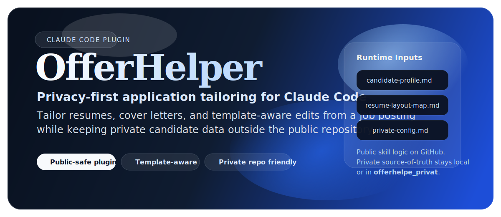
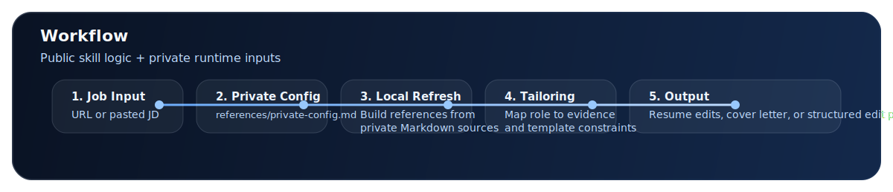

<p align="center">
  
</p>

# OfferHelper

<p align="center">
  <strong>Privacy-first Claude Code skill for tailoring resumes and cover letters from a job posting.</strong><br />
  <sub>Template-aware. Public-safe. Built for a clean split between open plugin logic and private candidate data.</sub>
</p>

<p align="center">
  <a href="https://github.com/zaneding/offerhelper"></a>
  <a href="./LICENSE"></a>
  <a href="./.claude-plugin/plugin.json"></a>
  <a href="#中文"></a>
</p>

<p align="center">
  <a href="#中文">中文</a> · <a href="#english">English</a>
</p>

OfferHelper is a Claude Code skill and plugin workflow for application tailoring. The public repo ships only reusable skill logic, templates, and onboarding. Personal candidate data, live Canva metadata, and private notes stay in a separate private repo or ignored local files, accessed through a single runtime interface: `references/private-config.md`.

> GitHub README does not support real tab components by default. This file uses GitHub-native `<details>` sections as the most stable bilingual switch pattern.

## At a Glance

| | |
|---|---|
| **Input** | Job posting URL or pasted JD |
| **Output** | `~/Downloads/<Company>_<JobTitle>/` with CV PDF, Anschreiben `.docx`, and `data.md` |
| **Resume editing** | Canva MCP — edits a per-job copy, never the master template |
| **Cover letter** | Word By Anthropic MCP connector — DIN 5008, Arial 11pt, one A4 page |
| **Application log** | `data.md` per job — top 3 screening criteria, CV rationale, edit link |
| **Privacy** | Public repo carries no real candidate data, Canva IDs, or contact info |

## Output Structure

Every completed application produces a self-contained folder in `~/Downloads/`:

```text
~/Downloads/<Company>_<JobTitle>/
├── CV_ZijianDing.pdf            ← Canva export, per-job copy
├── Anschreiben_ZijianDing.docx  ← DIN 5008, generated via Word MCP connector
└── data.md                      ← job metadata + top 3 screening criteria + CV rationale
```

## Quick Install

```bash
/plugin marketplace add offerhelper github:zaneding/offerhelper
/plugin install offerhelper@offerhelper
```

## How It Works

<p align="center">
  
</p>

<details open>
<summary><strong>中文</strong></summary>

<a id="中文"></a>

## 目录

- [项目定位](#cn-positioning)
- [为什么用它](#cn-why)
- [快速开始](#cn-quickstart)
- [首次配置](#cn-setup)
- [工作流](#cn-workflow)
- [输出结构](#cn-output)
- [Canva MCP 工具](#cn-canva-mcp)
- [Public / Private 分层](#cn-split)
- [私有接口：private-config](#cn-private-config)
- [仓库结构](#cn-structure)
- [FAQ](#cn-faq)

<a id="cn-positioning"></a>

## 项目定位

`OfferHelper` 是一个面向 Claude Code 的求职材料定制 skill。它读取职位链接或职位描述，结合候选人资料、简历模板映射和运行时配置，生成：

- 定制版简历内容（通过 Canva MCP 直接编辑模板副本）
- DIN 5008 格式的德语 Anschreiben（通过 Word By Anthropic MCP connector 生成 `.docx`）
- 每次申请的结构化记录文件 `data.md`

完整输出落在一个以岗位命名的文件夹里：`~/Downloads/<Company>_<JobTitle>/`

<a id="cn-why"></a>

## 为什么用它

| 优势 | 说明 |
|---|---|
| 隐私优先 | 公开仓库不携带真实候选人资料、联系方式、Canva 元数据 |
| 模板感知 | 输出面向 `resume-layout-map` 结构化改写，而非自由文本 |
| 每次申请留痕 | `data.md` 记录岗位信息、筛选标准、CV 调整说明，方便复盘 |
| 不改动母版 | 每次申请基于 master 副本编辑，母版始终只读 |
| 原生 Claude 工具链 | 简历用 Canva MCP，Anschreiben 用 Word MCP connector |

<a id="cn-quickstart"></a>

## 快速开始

### 1. 安装插件

```bash
/plugin marketplace add offerhelper github:zaneding/offerhelper
/plugin install offerhelper@offerhelper
```

### 2. 创建本地 `references/`

从公开模板复制出以下本地文件：

```text
skills/offerhelper/references/candidate-profile-template.md  →  references/candidate-profile.md
skills/offerhelper/references/resume-layout-map-template.md  →  references/resume-layout-map.md
skills/offerhelper/references/private-config.example.md      →  references/private-config.md
```

### 3. 开始使用

```text
这是我想申请的岗位：[职位链接或 JD]
```

默认输出完整套餐（简历 + Anschreiben），无需额外说明。

<a id="cn-setup"></a>

## 首次配置

1. 从 `skills/offerhelper/references/` 复制三个模板到本地 `references/`
2. 填写 `references/private-config.md`（联系方式、Canva master template ID 等）
3. 如果维护私有 repo，把真实资料路径写进 `private-config.md`
4. 首次使用时，让 Claude 先生成或刷新 `references/candidate-profile.md` 和 `references/resume-layout-map.md`

<a id="cn-workflow"></a>

## 工作流

```
1. 分析岗位     →  提取核心要求，确定角色类型（DA / BA / Strategy）
2. 制定策略     →  映射候选人证据，起草四个内容区域
3. 复制母版     →  在 Canva 中从 master 创建副本（每岗位独立）
4. 编辑副本     →  通过 Canva MCP 更新 subtitle、bullets、Kompetenzen
5. 导出 PDF     →  下载至本地
6. 生成 Anschreiben  →  Word MCP connector，一页，DIN 5008，Arial 11pt
7. 打包输出     →  创建 ~/Downloads/<Company>_<JobTitle>/，写入 data.md
```

<a id="cn-output"></a>

## 输出结构

每次申请完成后，Downloads 里新增一个以岗位命名的文件夹：

```text
~/Downloads/<Company>_<JobTitle>/
├── CV_ZijianDing.pdf            ← Canva 导出，per-job 副本
├── Anschreiben_ZijianDing.docx  ← DIN 5008，Word MCP connector 生成
└── data.md                      ← 岗位元数据 + Top 3 筛选标准 + CV 调整说明
```

`data.md` 示例：

```markdown
# Bewerbung
| 公司 | Wiz |
| 岗位 | Technical Account Manager |
| 日期 | 2026-04-22 |
| Canva 编辑链接 | https://... |

## Top-Screening-Kriterien
1. Enterprise Stakeholder Management
2. Cloud Security 技术能力
3. 客户成功 / KPI 追踪

## CV 调整说明
- Subtitle → "Technical Account Manager | Cloud Security & Stakeholder Management"
- BMW bullets → 以 Eskalationskoordination 和 KPI-Automatisierung 领衔
```

<a id="cn-canva-mcp"></a>

## Canva MCP 工具

`mcp/canva-tools/` 是一个自定义 MCP server，通过 Canva Connect API 自动复制 master 模板：

```text
mcp/canva-tools/
├── server.mjs   ← MCP server，暴露 duplicate_design tool
├── auth.mjs     ← OAuth token 刷新（读取 .env）
├── setup.mjs    ← 一次性 PKCE 授权流程
└── package.json
```

**配置步骤：**

```bash
cd mcp/canva-tools
npm install
node setup.mjs   # 一次性授权，写入 CANVA_REFRESH_TOKEN 到 .env
```

在 `~/.claude/settings.json` 中注册后，`duplicate_design` tool 即可在 Claude 会话中使用。

> 本地调试需配合 ngrok（Canva OAuth redirect URI 要求 HTTPS）。OAuth 配置完成前，可在 Canva 桌面 App 中手动创建副本并提供编辑链接。

<a id="cn-split"></a>

## Public / Private 分层

**公开 `main` 包含：** 插件元数据、公开 skill、公开模板、Canva MCP server 代码（不含 `.env`）、README

**私有 repo 或本地忽略文件包含：** 真实候选人经历、联系方式、Canva IDs、`references/private-config.md`、`.env`

<a id="cn-private-config"></a>

## 私有接口：`private-config`

公开 skill 通过一个入口读取私有配置：`references/private-config.md`

可包含：联系方式、template ID、edit URL、field mapping、私有 Markdown 源文件路径。

<a id="cn-structure"></a>

## 仓库结构

```text
offerhelper/
├── .claude-plugin/
│   └── plugin.json
├── skills/
│   └── offerhelper/
│       ├── SKILL.md
│       └── references/
│           ├── candidate-profile-template.md
│           ├── resume-layout-map-template.md
│           └── private-config.example.md
├── mcp/
│   └── canva-tools/          ← Canva Connect API MCP server
│       ├── server.mjs
│       ├── auth.mjs
│       ├── setup.mjs
│       └── package.json
├── scripts/
│   ├── validate-readme.mjs
│   ├── validate-public-safety.mjs
│   └── canva-duplicate.mjs   ← 独立 CLI（备用）
├── .gitignore
├── package.json
└── README.md
```

本地运行时（被 `.gitignore` 排除）：

```text
references/
├── candidate-profile.md
├── resume-layout-map.md
└── private-config.md
.env   ← CANVA_CLIENT_ID / SECRET / REFRESH_TOKEN
```

<a id="cn-faq"></a>

## FAQ

**母版会被修改吗？**  
不会。每次申请先复制 master，所有编辑都在副本上进行。

**Anschreiben 会弹出 Word 吗？**  
Word 会短暂在后台打开，由 MCP connector 写入文件。不需要手动操作。

**Canva MCP 需要先配置 OAuth 吗？**  
是的，运行一次 `node mcp/canva-tools/setup.mjs`。未配置时，可手动在 Canva App 创建副本并提供编辑链接。

**私有资料一定要放 private repo 吗？**  
不必须。本地忽略文件就够，private repo 只是长期维护更清晰。

</details>

<details>
<summary><strong>English</strong></summary>

<a id="english"></a>

## Contents

- [Positioning](#en-positioning)
- [Why Use It](#en-why)
- [Quick Start](#en-quickstart)
- [First-Time Setup](#en-setup)
- [Workflow](#en-workflow)
- [Output Structure](#en-output)
- [Canva MCP Tool](#en-canva-mcp)
- [Public / Private Split](#en-split)
- [Private Interface: private-config](#en-private-config)
- [Repository Structure](#en-structure)
- [FAQ](#en-faq)

<a id="en-positioning"></a>

## Positioning

`OfferHelper` is a Claude Code skill for tailoring job application materials. It reads a job posting URL or pasted JD and produces:

- tailored resume content edited directly into a Canva template copy via Canva MCP
- a German DIN 5008 cover letter as `.docx` via the Word By Anthropic MCP connector
- a structured application log `data.md` per job

All output lands in a single named folder: `~/Downloads/<Company>_<JobTitle>/`

<a id="en-why"></a>

## Why Use It

| Advantage | Description |
|---|---|
| Privacy-first | Public repo ships no real candidate profile, contact info, or Canva metadata |
| Template-aware | Output is shaped to a `resume-layout-map`, not free-form text |
| Per-application audit trail | `data.md` records job info, screening criteria, and CV change rationale |
| Master stays untouched | Every application works on a per-job copy — master is read-only |
| Native Claude toolchain | Canva MCP for resume, Word MCP connector for cover letter |

<a id="en-quickstart"></a>

## Quick Start

### 1. Install the plugin

```bash
/plugin marketplace add offerhelper github:zaneding/offerhelper
/plugin install offerhelper@offerhelper
```

### 2. Create local `references/`

```text
skills/offerhelper/references/candidate-profile-template.md  →  references/candidate-profile.md
skills/offerhelper/references/resume-layout-map-template.md  →  references/resume-layout-map.md
skills/offerhelper/references/private-config.example.md      →  references/private-config.md
```

### 3. Start using it

```text
Here is the job posting: [URL or pasted JD]
```

Default output is the full package (CV + Anschreiben). No further prompt needed.

<a id="en-setup"></a>

## First-Time Setup

1. Copy the three public templates from `skills/offerhelper/references/` into local `references/`
2. Fill `references/private-config.md` (contact info, Canva master template ID, etc.)
3. If you maintain a private repo, add source file paths to `private-config.md`
4. On first run, let Claude generate or refresh `candidate-profile.md` and `resume-layout-map.md`

<a id="en-workflow"></a>

## Workflow

```
1. Analyze job       →  extract requirements, classify role type (DA / BA / Strategy)
2. Build strategy    →  map candidate evidence, draft four content zones
3. Duplicate master  →  create a per-job Canva copy (master stays read-only)
4. Edit copy         →  update subtitle, bullets, Kompetenzen via Canva MCP
5. Export PDF        →  download locally
6. Generate Anschreiben  →  Word MCP connector, one page, DIN 5008, Arial 11pt
7. Package output    →  create ~/Downloads/<Company>_<JobTitle>/, write data.md
```

<a id="en-output"></a>

## Output Structure

Each completed application adds a named folder to `~/Downloads/`:

```text
~/Downloads/<Company>_<JobTitle>/
├── CV_ZijianDing.pdf            ← Canva export, per-job copy
├── Anschreiben_ZijianDing.docx  ← DIN 5008, generated via Word MCP connector
└── data.md                      ← job metadata + top 3 screening criteria + CV rationale
```

<a id="en-canva-mcp"></a>

## Canva MCP Tool

`mcp/canva-tools/` is a custom MCP server for duplicating the master Canva template via the Canva Connect API:

```text
mcp/canva-tools/
├── server.mjs   ← MCP server exposing the duplicate_design tool
├── auth.mjs     ← OAuth token refresh (reads .env)
├── setup.mjs    ← one-time PKCE authorization flow
└── package.json
```

```bash
cd mcp/canva-tools && npm install && node setup.mjs
```

Register the server in `~/.claude/settings.json` to make `duplicate_design` available in any Claude session.

> Local testing requires ngrok (Canva OAuth redirect URIs must be HTTPS). Until OAuth is configured, duplicate the master manually in the Canva app and share the edit link.

<a id="en-split"></a>

## Public / Private Split

**Public `main` contains:** plugin metadata, public skill, public templates, Canva MCP server code (no `.env`), README

**Private repo or ignored local files contain:** real candidate experience, contact details, Canva IDs, `references/private-config.md`, `.env`

<a id="en-private-config"></a>

## Private Interface: `private-config`

The skill reads all private runtime data through one file: `references/private-config.md`

It holds: contact info, template metadata, field mappings, output preferences, and optional private Markdown source paths.

<a id="en-structure"></a>

## Repository Structure

```text
offerhelper/
├── .claude-plugin/
│   └── plugin.json
├── skills/
│   └── offerhelper/
│       ├── SKILL.md
│       └── references/
│           ├── candidate-profile-template.md
│           ├── resume-layout-map-template.md
│           └── private-config.example.md
├── mcp/
│   └── canva-tools/          ← Canva Connect API MCP server
│       ├── server.mjs
│       ├── auth.mjs
│       ├── setup.mjs
│       └── package.json
├── scripts/
│   ├── validate-readme.mjs
│   ├── validate-public-safety.mjs
│   └── canva-duplicate.mjs   ← standalone CLI fallback
├── .gitignore
├── package.json
└── README.md
```

Local runtime files (git-ignored):

```text
references/
├── candidate-profile.md
├── resume-layout-map.md
└── private-config.md
.env   ← CANVA_CLIENT_ID / SECRET / REFRESH_TOKEN
```

<a id="en-faq"></a>

## FAQ

**Will the master template be modified?**  
No. The skill always creates a per-job copy first. The master is never opened for editing.

**Does generating the Anschreiben open Word?**  
Word opens briefly in the background while the MCP connector writes the file. No manual interaction required.

**Do I need to configure Canva OAuth before using the MCP?**  
Yes — run `node mcp/canva-tools/setup.mjs` once. Until then, duplicate the master manually in the Canva app.

**Do I need a separate private repo?**  
No. Local git-ignored files are sufficient. A separate private repo is cleaner for long-term maintenance.

</details>
